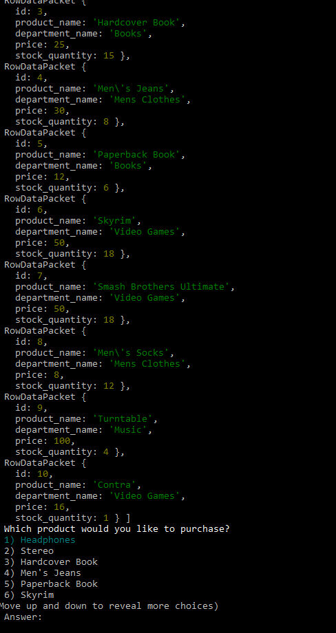
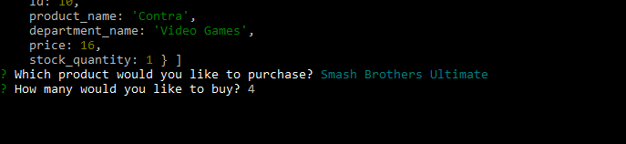
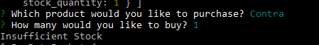

# bamazon

Bamazon is a command-line node application. 
Like Amazon, Bamazon will display an inventory of products and prompt the user to purchase. 

A user can select an item from a list and then enter a quantity:

If the item is in stock, the user will receive a purchase receipt with a total:

If the item is out of stock, or the requested amount is too high, a message of insufficient stock is returned:

